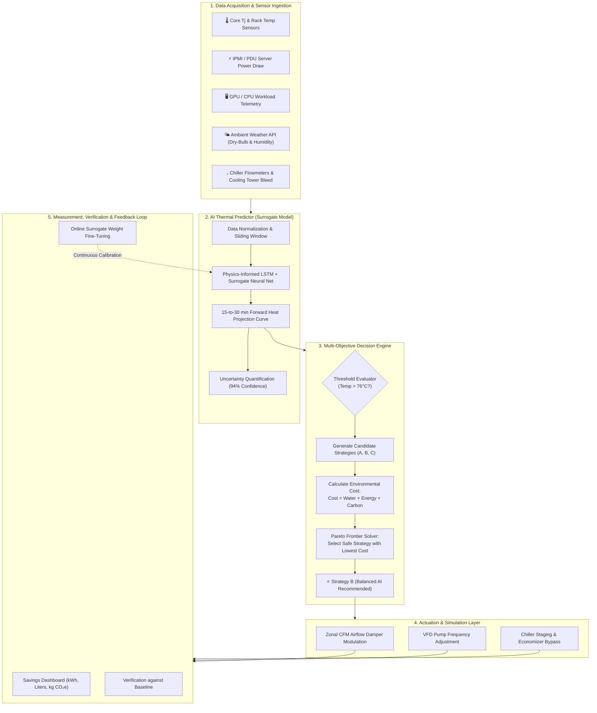
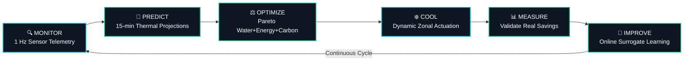
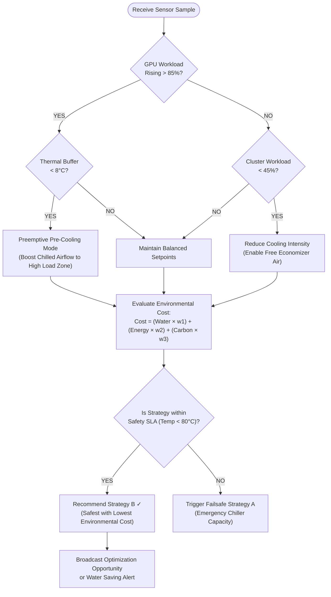
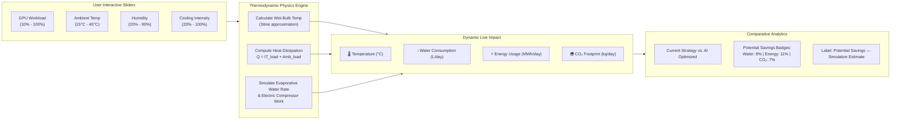
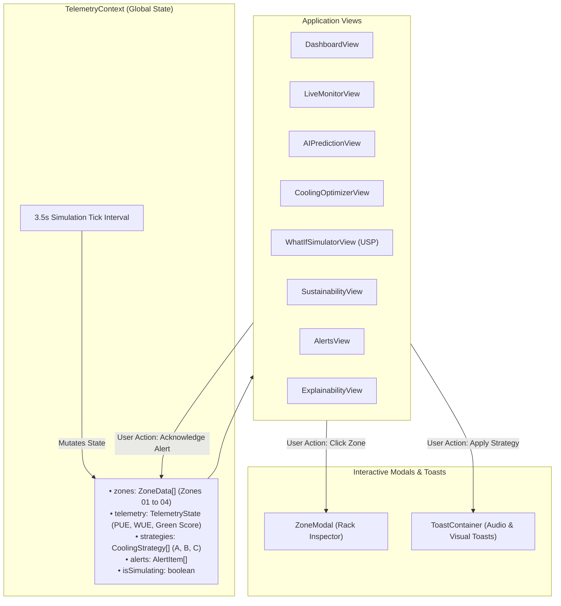

# 🔄 Green AI Monitor — System Flowcharts & Architecture Workflows

This document outlines the operational pipelines, closed-loop decision algorithms, and component data flows of the **Green AI Monitor** Data Center Cooling Sustainability Decision Engine.

---

## 1. End-to-End System Architecture Flowchart



---

## 2. Sustainable AI Cooling Closed Loop



> **Caption**: *“Green AI Monitor continuously learns from operational data to improve cooling efficiency.”*

---

## 3. Decision Logic Flowchart (Pareto Evaluation)



---

## 4. ⭐ What-if Cooling Simulator Pipeline



---

## 5. UI Component & Context State Flow



---

## 6. ASCII Diagram (Text-Only / CLI Friendly)

```
================================================================================
                    GREEN AI MONITOR — OPERATIONAL FLOW
================================================================================

 [Sensors & Data Center Telemetry]
   │ (Inlet/Outlet Temp, Workload %, Ambient RH %, Chiller Power)
   ▼
 [AI Thermal Predictor (Surrogate Neural Network)]
   │ (Projects 15-min thermal inertia trajectory, 94% Confidence)
   ▼
 [Water + Energy + Carbon Pareto Optimizer]
   │
   ├─► Strategy A: Max Cooling      (Energy: 100 | Water: 20 | Safety: 99%)
   ├─► Strategy B: Balanced [AI Rec] (Energy: 86  | Water: 14 | Safety: 97%)
   └─► Strategy C: Eco Cooling      (Energy: 78  | Water: 10 | Safety: 91%)
   │
   ▼
 [Selected: Strategy B — Lowest Environmental Cost with Safe Headroom]
   │
   ├─► Zone 03 (High GPU Load): Chilled airflow CFM increased by +18%
   ├─► Zone 01 (Low GPU Load):  Excess airflow reduced by -12%
   │
   ▼
 [Simulation & Actuation Control Layer]
   │
   ▼
 [Sustainability Feedback Loop]
   └──> Recorded Potential Savings: 8% Water · 11% Energy · 7% Carbon
================================================================================
```
